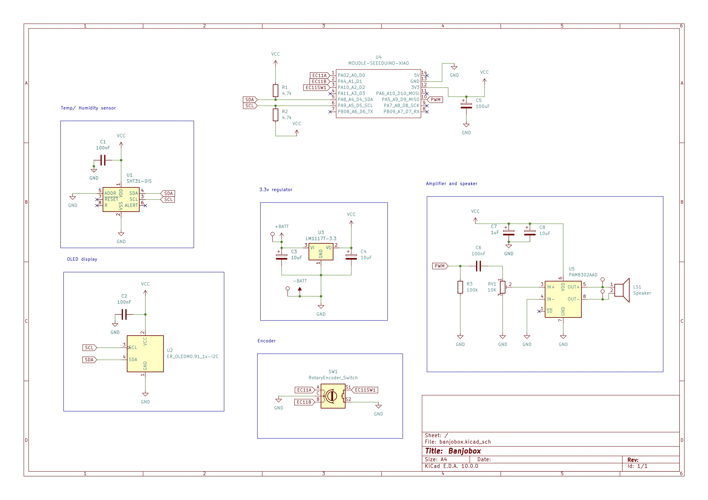

# Banjobox

Banjobox features a Seeed Studios Xiao RP2040 running MicroPython. UI consists of a rotary encoder and 0.91" OLED display. You can select different notes to be played through the speaker to tune your banjo.

### Features:
 - Seeed Studios Xiao RP2040
 - SHT31 temp + humidity sensor
 - PAM8302 Class-D amp with 3W 4ohm speaker
 - Powered by 3x AA batteries
 - 0.91 inch OLED display
 - EC11 rotary encoder

## OnShape project
https://cad.onshape.com/documents/49037cb32e4fd0c851c4d81b/w/99bbea41b70cb909ece41dd4/e/4da4cdf8e8884e6941d1b422?renderMode=0&uiState=69cc3025f9c68d0f90eed99a

## Schematic

## Construction tips
Construction of the case requires minimal woodworking skills and tools. I reccomend using some wood screws rather than relying on glue alone.

 - Add felt padding where appropriate (including this in the CAD model was impractical). The green blocks on the lid can be made by wrapping foam with felt.
 - Heel supports can be reinforced with metal brackets or dowels
 - Remember to cut holes to run wires!
 - Hold battery holder in place with double sided tape or sticky foam.
 - Electronics parts are held in place by two acrylic covers. Use long M3 bolts or threaded rod to mount the PCB
