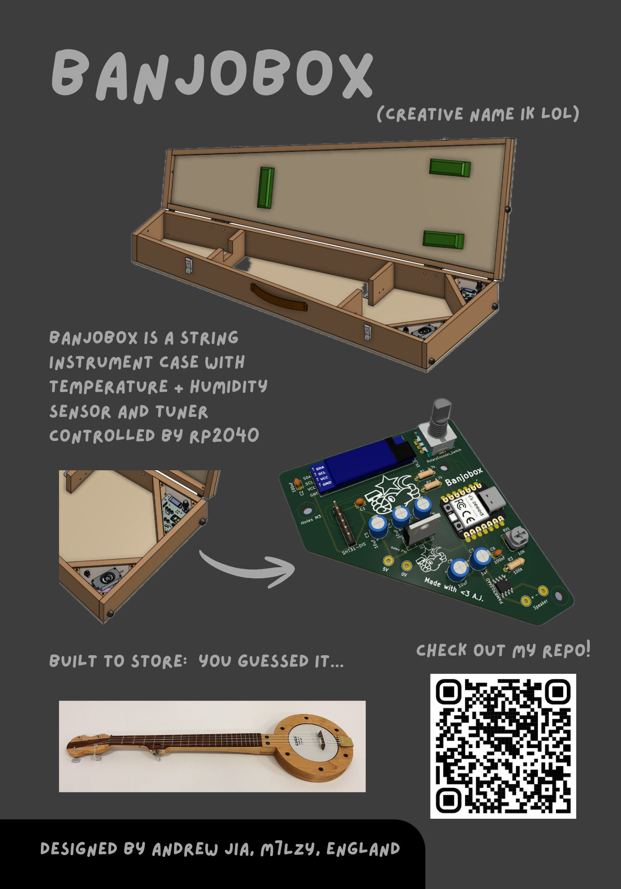
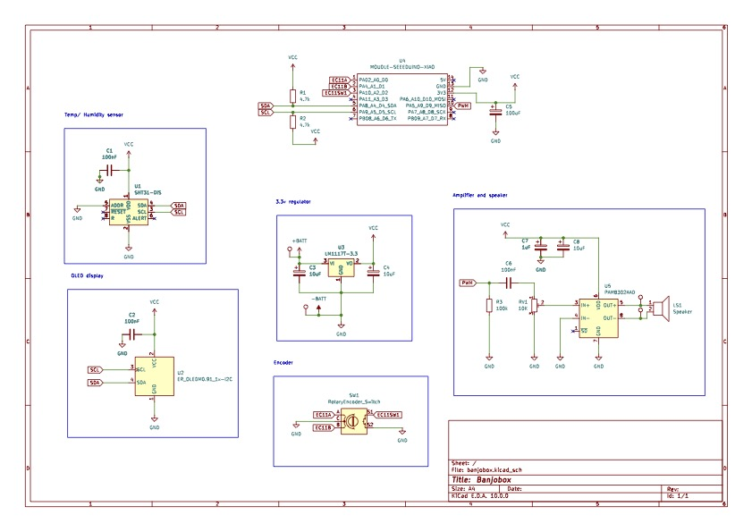
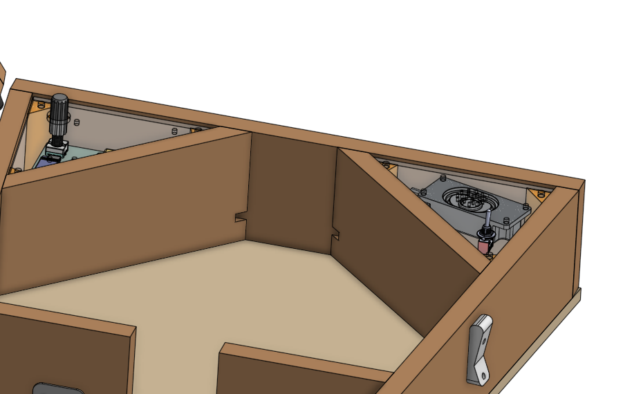
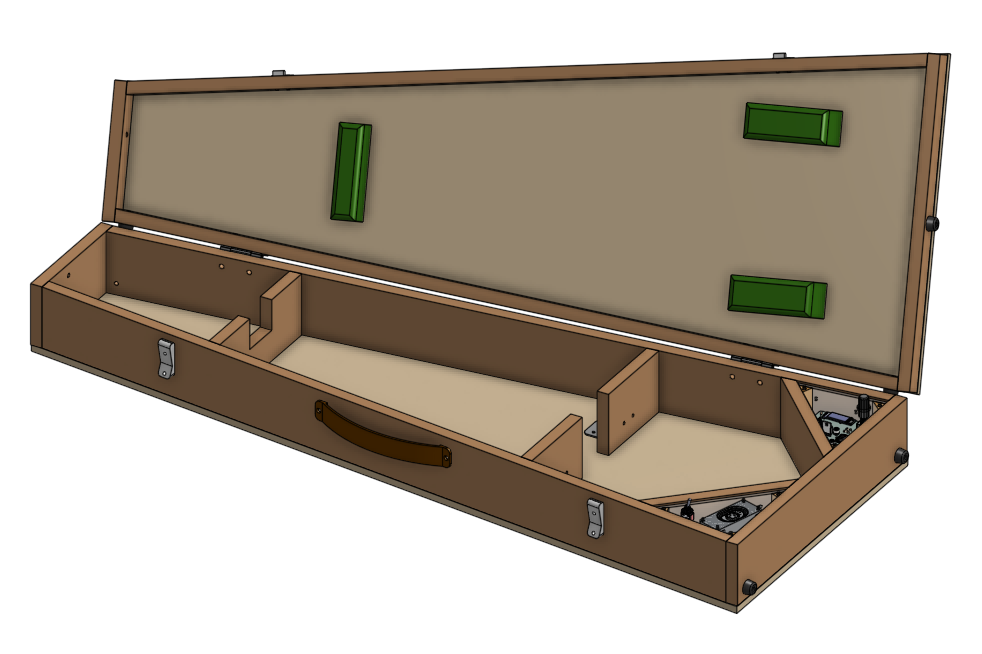
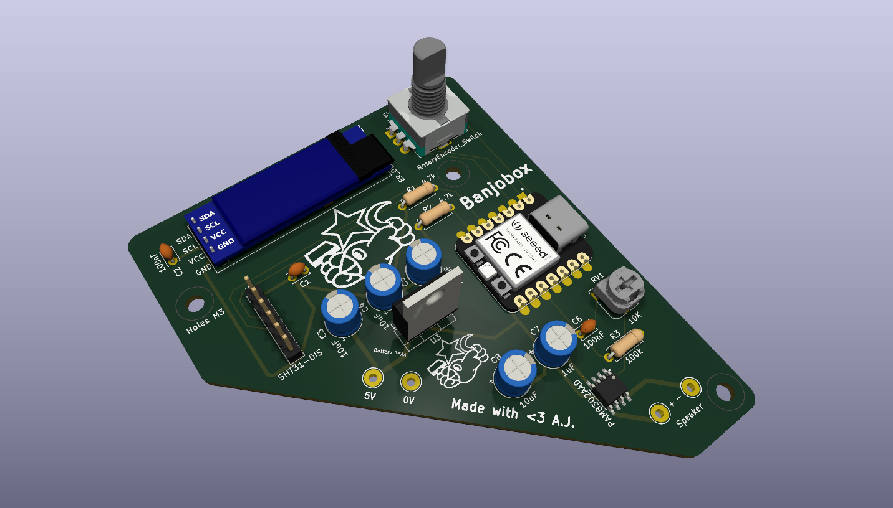

# Banjobox

Banjobox is a banjo case with a built in tuner and temperature/ humidity sensor. I designed it to store a mountain banjo I made but the case can be modified to accomodate other string instruments.

Purchasing a banjo case is difficult, especially as shape varies a lot. Banjobox is low cost (plywood, softwood timber) and super customiseable!

Banjobox features a Seeed Studios Xiao RP2040 running MicroPython. UI consists of a rotary encoder and 0.91" OLED display. You can select different notes to be played through the speaker to tune your banjo.

Pressing the rotary encoder button switches between monitor mode and tune mode. Monitor mode displays temperature and humidity readings. Tune mode plays a square wave. Turning the knob changes the note played.

Files for 3D printing and laser cutting can be found in the OnShape project linked below.

### Features:
 - Seeed Studios Xiao RP2040
 - SHT31 temp + humidity sensor
 - PAM8302 Class-D amp with 3W 4ohm speaker
 - Powered by 3x AA batteries
 - 0.91 inch OLED display
 - EC11 rotary encoder

## OnShape project
https://cad.onshape.com/documents/49037cb32e4fd0c851c4d81b/w/99bbea41b70cb909ece41dd4/e/4da4cdf8e8884e6941d1b422?renderMode=0&uiState=69cc3025f9c68d0f90eed99a

## Schematic

## Case construction tips
Construction of the case requires minimal woodworking skills and tools. I reccomend using some wood screws rather than relying on glue alone. A full set of plans can be found in the production folder.

### General
 - Add felt padding where appropriate (including this in the CAD model was impractical). The green blocks on the lid can be made by wrapping foam with felt.
 - Heel supports can be reinforced with metal brackets or dowels
 - Remember to cut holes to run wires!
 - Hold battery holder in place with double sided tape or sticky foam.
 - SHT31 breakout board to be fixed inside battery compartment with sticky foam. Speaker vents will ensure good airflow
 - Electronics parts are held in place by two acrylic covers. Use long M3 bolts or threaded rod to mount the PCB

### 3D printing
 - The PCB cover and speaker/ battery cover are each supported by three 3D printed columns
 - Insert M3 heatset insert
 - Glue in place

### Laser cutting
 - Laser cut PCB and spekeaker/ battery covers from clear acrylic
 - Recommended 4mm but exact thickness is unimportant

Remember to cut wire holes in the side supports! See below:

## Images

## BOM
NOTE: Links are suggestions only. Some parts are ubiquitous and purchasing online would be impractical. I'm from Blighty hence some links might not work if you live overseas. Prices may vary.
| Quantity | Item                          | Cost/£ | Link |
|----------|-------------------------------|--------|--------|
| 1        | Seeed Studios Xiao RP2040     | 3.90   | https://thepihut.com/products/seeed-xiao-rp2040 |
| 1        | PCB                           | 5.00      | https://jlcpcb.com/ |
| 1        | 0.91 inch OLED               | 3.80   | https://www.aliexpress.com/item/1005006365845676.html |
| 1        | SHT31 breakout board         | 1.57   | https://www.aliexpress.com/item/32695064184.html |
| -        | Components                    | 10.00      | https://www.digikey.co.uk/ |
| 1        | 3W speaker                   | 3.40   | https://thepihut.com/products/mono-enclosed-speaker-3w-4-ohm |
| 1        | Toggle switch                | 1.67   | https://www.digikey.co.uk/en/products/detail/cit-relay-and-switch/ANT11SEBQE/12503360 |
| 1        | 3xAA battery holder          | 1.99   | https://www.ebay.co.uk/itm/358406972409?_skw=3+x+aa+battery+holder |
| 6        | 3D printed parts             | 2.00      | https://jlcpcb.com/ |
| 2        | laser-cut acrylic            | 0.50      | https://jlcpcb.com/ |
| 6        | Heatset insert               | 2.89   | https://www.ebay.co.uk/itm/314297471901 |
| 13       | M3 screw                     | 7.59   | https://www.ebay.co.uk/itm/305743217020 |
| 7        | M3 nut                       | 3.38   | https://www.ebay.co.uk/itm/167673257973 |
| -        | Wood screws                  | 7.74      | https://www.ebay.co.uk/itm/277661008745?_skw=wood+screws |
| -        | 15mm timber      | 16.00      | https://www.homedepot.com/p/Waddell-Project-Board-24-in-x-4-in-x-0-5-in-Unfinished-S4S-Poplar-Hardwood-w-No-Finger-Joints-Ideal-for-DIY-Shelving-PB19418/329189316 |
| 1        | Plywood 9mm                  | 30.00  | https://www.ebay.co.uk/itm/257438787345?_skw=9mm+plywood |
| 2        | Hinges                       | 1.97   | https://www.ebay.co.uk/itm/222426341432 |
| 2        | Hook and latch               | 3.60   | https://www.ebay.co.uk/itm/168179187930 |
| 1        | Handle                       | 4.20   | https://www.ebay.co.uk/itm/306436283287 |
| 11       | Rubber feet                  | 3.29   | https://www.ebay.co.uk/itm/173200464234 |
| -        | Foam padding                 | 10.99  | https://www.ebay.co.uk/itm/112490209816 |
| -        | Felt padding                 | 6.25   | https://www.ebay.co.uk/itm/188091406494 |
|TOTAL:    |                              | 131.73 | |
